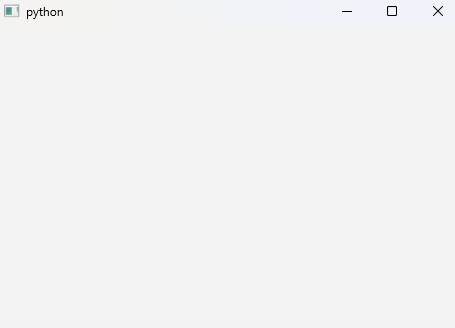

---
hide:
    toc
---

To create an empty window, we need two ingredients: a [`QApplication`](../QtWidgets/QApplication.md) object and a [`QMainWindow`](../QtWidgets/QMainWindow.md) object. The `QApplication` object manages the GUI application's control flow and main settings, while the `QMainWindow` object provides the framework for building an application's user interface. 

```python title="simple_gui.py" linenums="1" hl_lines="5-8"
from PySide6 import QtWidgets
from PySide6.QtCore import Slot


app = QtWidgets.QApplication()
window = QtWidgets.QMainWindow()
window.show()
app.exec()
```

The code above creates an empty window. The [`show()`][code.QtWidgets.QMainWindow.show] method displays the window, and the [`exec()`][code.QtWidgets.QApplication.exec] method starts the application's event loop. The event loop is a loop that waits for events to happen and then dispatches them to the appropriate event handlers. Examples of events are clicking on buttons in your application or typing text into a text field. Adding the above code to the script will show an empty window:




<br>
<hr>